# g4fig

`g4fig` turns Geant4 GDML geometry into quiet, publication-ready figures.
It is a batch filter rather than an interactive event display: diagnostics go to
standard error, SVG goes to standard output, and the self-contained wrapper can
write SVG, PNG, or PDF according to the extension passed to `-o`.

```sh
g4fig detector.gdml > detector.svg
g4fig -o detector.pdf detector.gdml
g4fig -o detector.png detector.gdml
g4fig --view 1,0.25,-0.12 --exclude 'rock|world' detector.gdml > beamline.svg
g4fig --label 'target=Graphite target' detector.gdml > labelled.svg
```

The default rendering is a vivid orange wireframe on white paper, with depth
fading and a soft fade at the canvas edge. Labels have feathered white halos so
geometry recedes behind the text without an opaque callout box.

## Gallery

[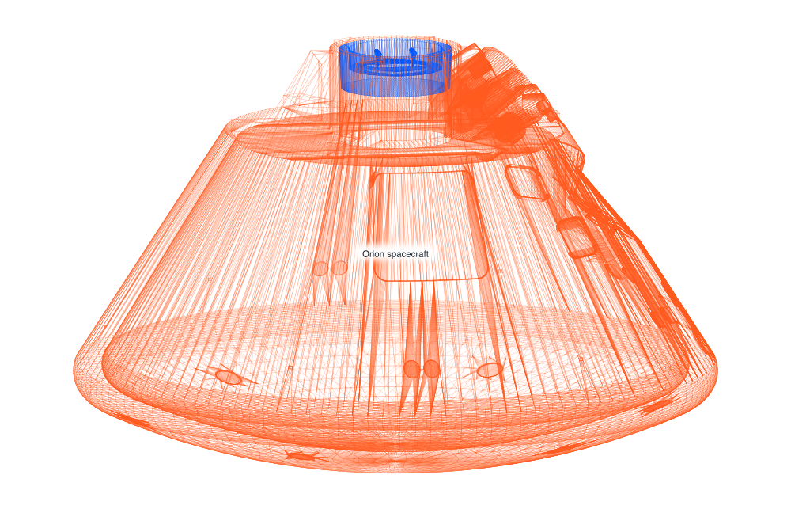](gallery/orion.pdf)

[Orion spacecraft (PDF)](gallery/orion.pdf)

[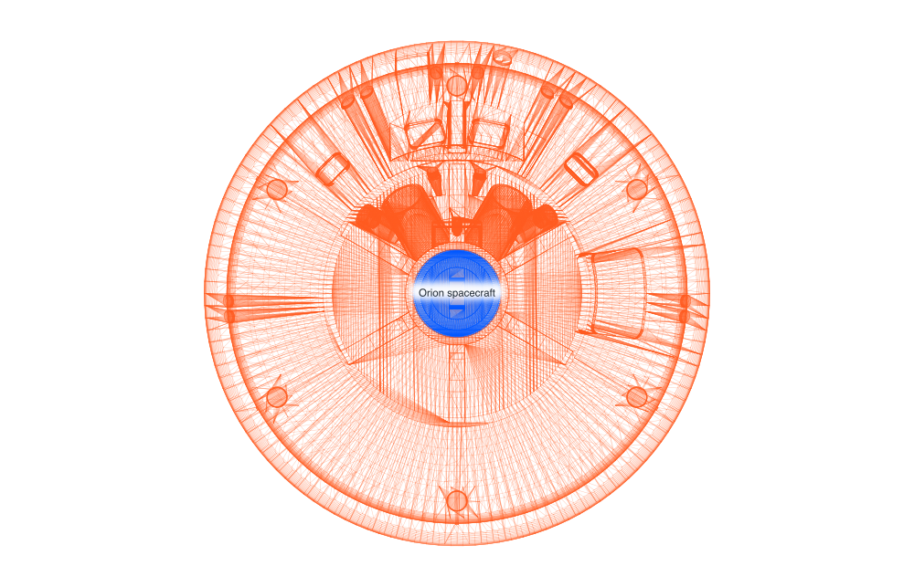](gallery/orion-axial.pdf)

[Orion spacecraft — axial view (PDF)](gallery/orion-axial.pdf)

[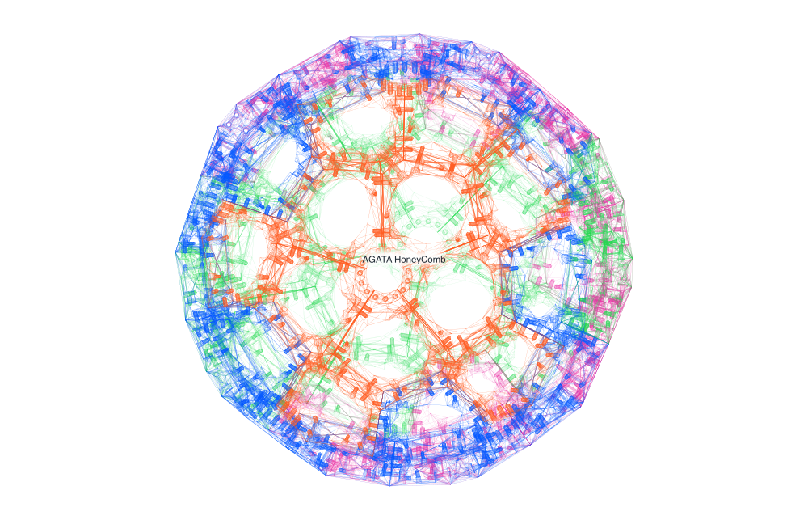](gallery/agata-honeycomb.pdf)

[AGATA spherical honeycomb (PDF)](gallery/agata-honeycomb.pdf)

[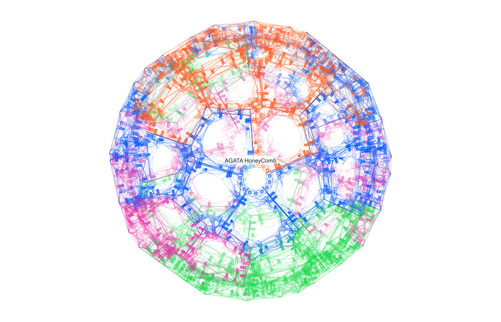](gallery/agata-honeycomb-oblique.pdf)

[AGATA spherical honeycomb — oblique view (PDF)](gallery/agata-honeycomb-oblique.pdf)

[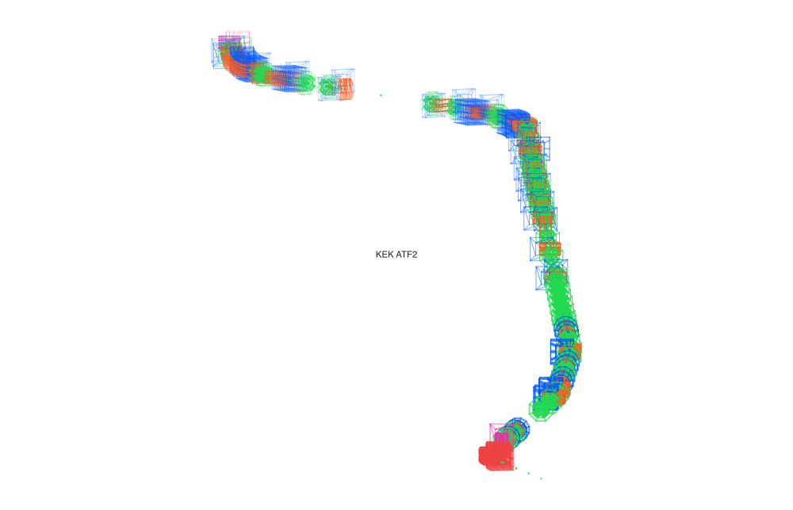](gallery/atf2.pdf)

[KEK ATF2 final-focus beamline (PDF)](gallery/atf2.pdf)

[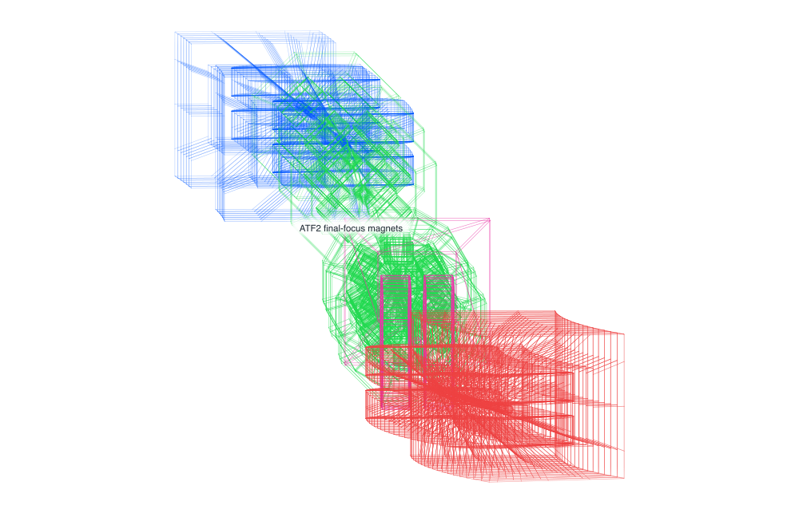](gallery/atf2-downbeam.pdf)

[KEK ATF2 — down-beam final-focus region (PDF)](gallery/atf2-downbeam.pdf)

[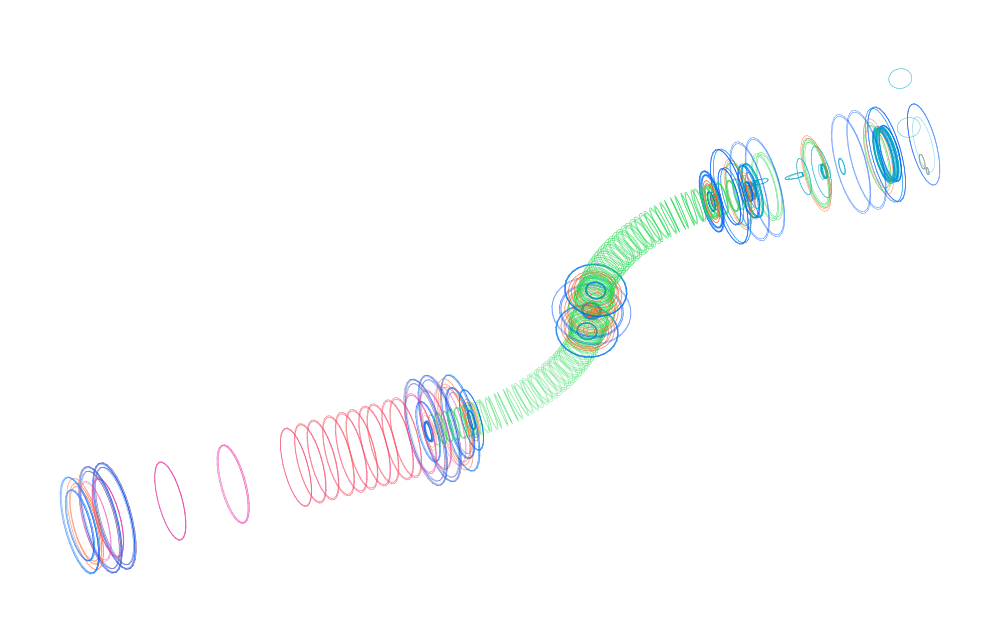](gallery/mu2e-solenoid-train.pdf)

[Mu2e complete experiment — solenoid train (PDF)](gallery/mu2e-solenoid-train.pdf)

[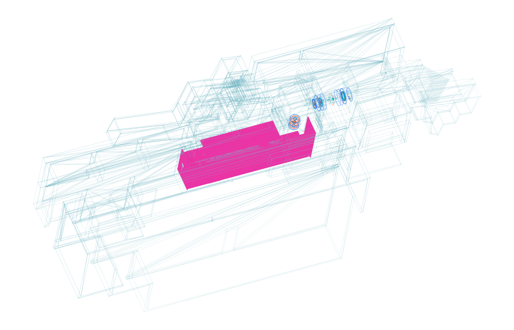](gallery/mu2e-facility-cutaway.pdf)

[Mu2e complete experiment — facility cutaway (PDF)](gallery/mu2e-facility-cutaway.pdf)

[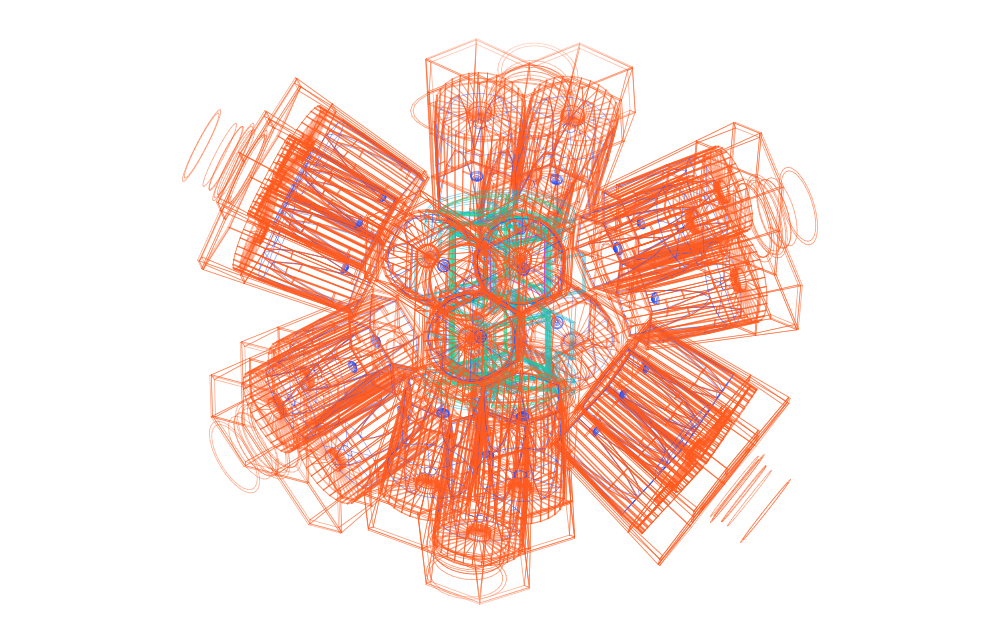](gallery/trex-miniball-oblique.pdf)

[TRex with Miniball — oblique view (PDF)](gallery/trex-miniball-oblique.pdf)

[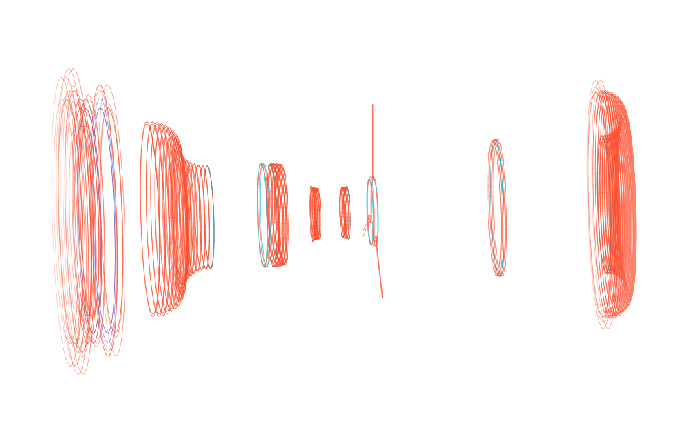](gallery/lbnf-horn3-detail.pdf)

[LBNF focusing horn 3 detail (PDF)](gallery/lbnf-horn3-detail.pdf)

[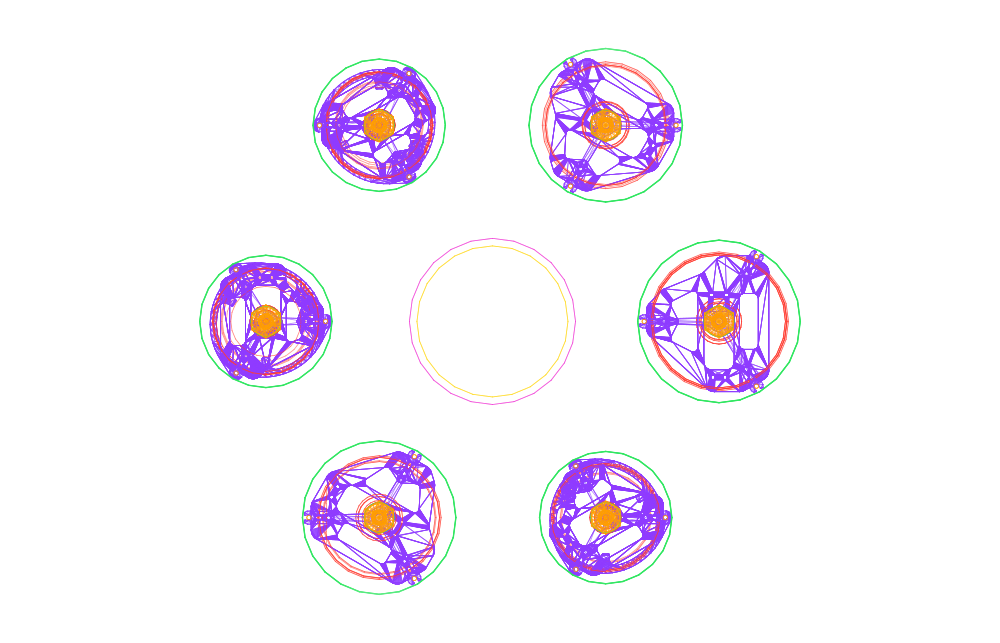](gallery/l200-array-axial.pdf)

[GERDA / LEGEND-200 detector array — axial view (PDF)](gallery/l200-array-axial.pdf)

[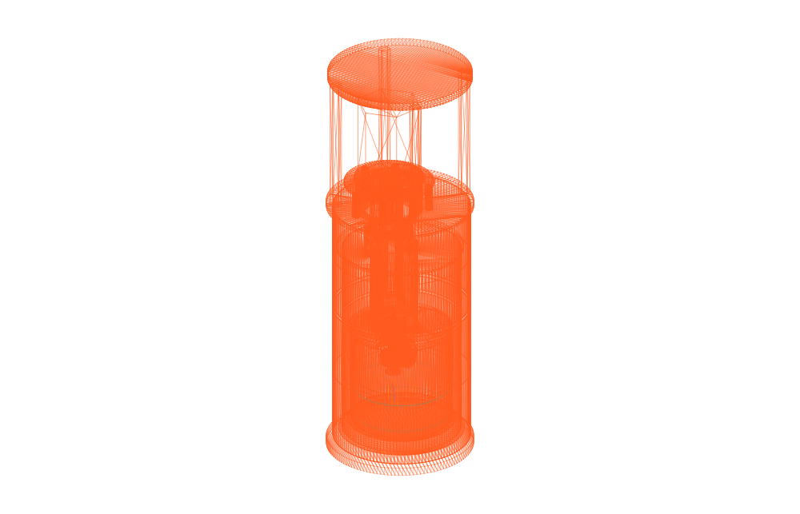](gallery/bigtes-hero-oblique.pdf)

[BigTES cryogenic detector — oblique view (PDF)](gallery/bigtes-hero-oblique.pdf)

[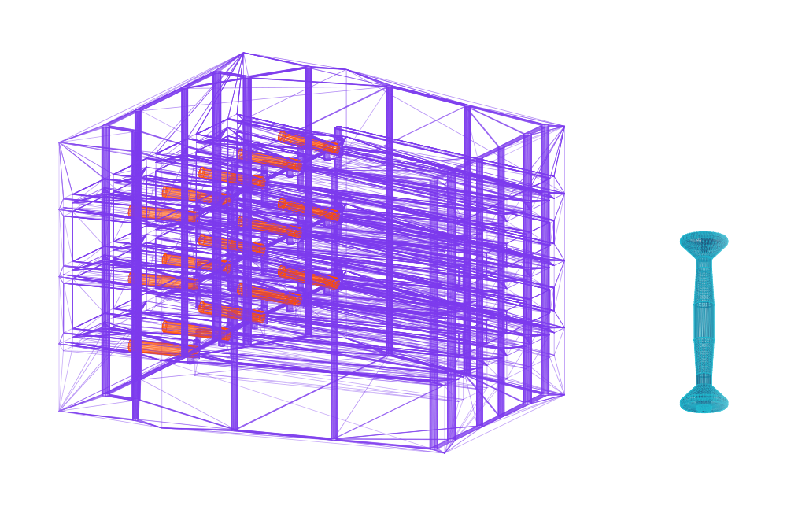](gallery/neutron-camera-hero-oblique.pdf)

[EJ-276D ORB neutron camera — oblique view (PDF)](gallery/neutron-camera-hero-oblique.pdf)

[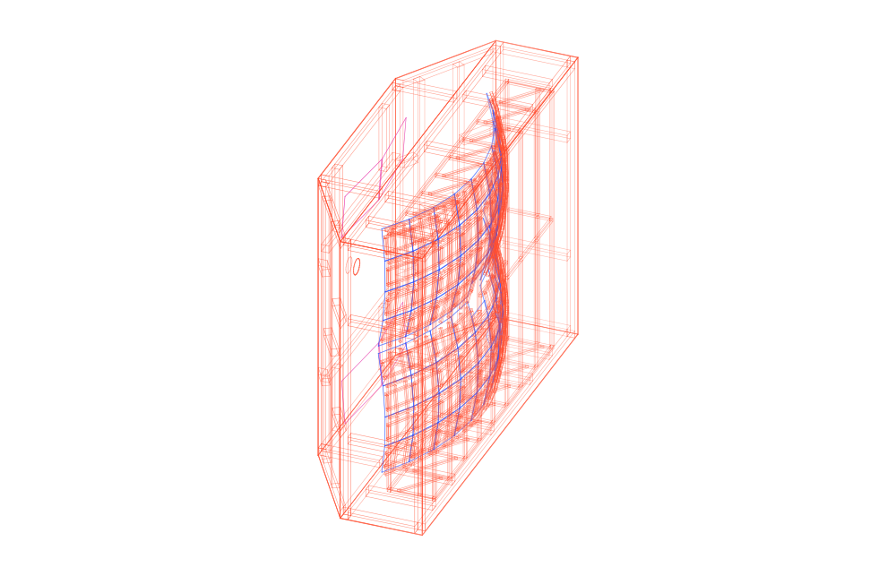](gallery/rich-hero-oblique.pdf)

[CBM RICH v13c — oblique view (PDF)](gallery/rich-hero-oblique.pdf)

[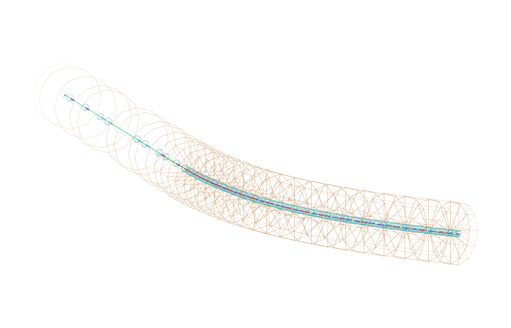](gallery/bdsim-downbeam.pdf)

[BDSIM single-pass beam transport — down-beam view (PDF)](gallery/bdsim-downbeam.pdf)

[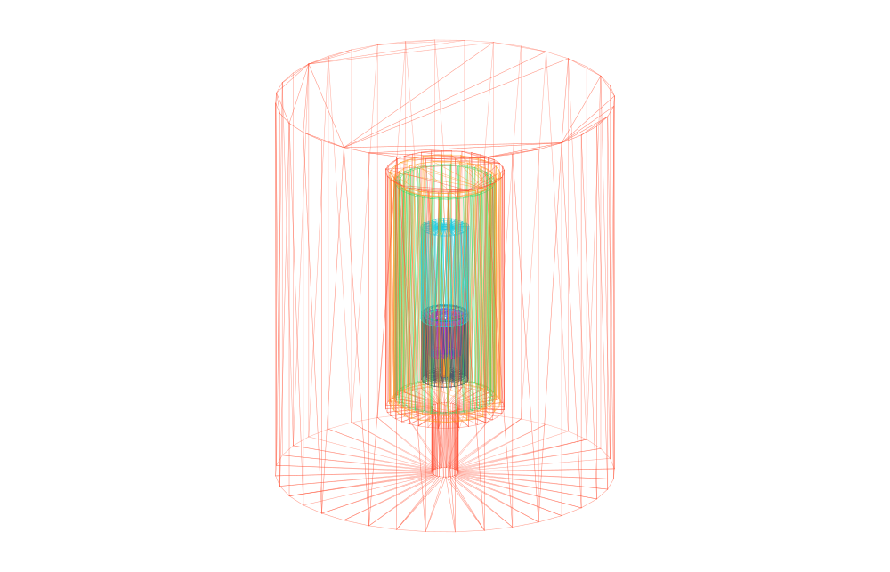](gallery/hpge-hero-oblique.pdf)

[HPGe source geometry — oblique view (PDF)](gallery/hpge-hero-oblique.pdf)

See the [stacked detector and beamline gallery](gallery/detector-views.md) for
all 31 views.

## Commands

```text
g4fig [options] FILE.gdml

  -o FILE                  write SVG, PNG, or PDF according to its extension
  --list                   list placed volumes as TSV instead of rendering
  --size WIDTHxHEIGHT      canvas size (default: 1200x675)
  --view X,Y,Z             direction from the scene toward the camera
  --up X,Y,Z               approximate screen-up direction
  --include REGEX          keep matching volume paths, names, or materials
  --exclude REGEX          omit matching volume paths, names, or materials
  --style REGEX=COLOUR     colour matching volumes; may be repeated
  --label REGEX=TEXT       label the centre of matching geometry; repeatable
  --tracks FILE            overlay `x1 y1 z1 x2 y2 z2 [class]` rows
  --track-scale NUMBER     multiply track coordinates by NUMBER
  --fade FRACTION          canvas-edge fade width (default: 0.07)
  --depth-fade STRENGTH    distant-line fade from 0 to 1 (default: 0.65)
  --line-width NUMBER      geometry line width (default: 0.85)
  --padding FRACTION       fitted-geometry margin (default: 0.055)
  --sides NUMBER           curved-solid tessellation (default: 24)
  --max-depth NUMBER       stop traversal at hierarchy depth
  --max-lines NUMBER       geometry-line safety limit (default: 1000000)
  --show-world             include the top-level world solid
  --aux-edges              include normally hidden tessellation edges
```

Patterns are POSIX extended regular expressions. A style uses any SVG colour,
for example `--style 'target=#253746' --style 'horn=#e66b43'`. Track classes
have built-in high-contrast particle colours (`proton`, `pi+`, `pi-`, `kaon+`,
`kaon-`, `mu+`, and `mu-`); unknown classes are dark blue.

To inspect a file before deciding what to draw:

```sh
g4fig --list detector.gdml | column -ts $'\t' | less -S
```

## Build

With a GDML-enabled Geant4 installation:

```sh
cmake -S . -B build -DCMAKE_BUILD_TYPE=Release
cmake --build build --parallel
cmake --install build --prefix ~/.local
```

Geant4 11.4 and C++17 are the supported baseline. No Geant4 visual driver,
window system, ROOT installation, or physics data set is needed.

For a self-contained Docker build, use the wrapper from a directory containing
the GDML file:

```sh
/path/to/g4fig/bin/g4fig detector.gdml > detector.svg
/path/to/g4fig/bin/g4fig -o detector.pdf detector.gdml
/path/to/g4fig/bin/g4fig -o detector.png detector.gdml
```

It builds the pinned `g4fig:local` image on first use, refreshes older local
images that lack these output formats, and mounts only the current directory at
`/work`. SVG remains the native renderer format;
`librsvg` conversion for `.png` and `.pdf` output is included in the image.
A locally built C++ binary writes SVG, including when `-o` is used.

## Example: Orion spacecraft

Render the partial, simplified Orion model distributed with Geant4's `gorad`
advanced example:

```sh
./examples/orion/render.sh
```

This downloads and verifies the upstream GDML, then writes a labelled SVG and,
when `rsvg-convert` is available, a PNG under `out/orion/`. See
[`examples/orion/`](examples/orion/) for the exact camera and styling choices.

## Example: HIRAX spacecraft

Render ten whole-spacecraft, orthographic, axial, and instrument-detail views:

```sh
./examples/hirax/render.sh
```

The script downloads and verifies only the standalone HIRAX GDML, then writes
SVG and, when `rsvg-convert` is available, matching PDF and PNG files under
`out/hirax/`. See the [stacked HIRAX gallery](gallery/hirax-views.md).

## Example: CUSP CubeSat

Render seven whole-model and five detector-detail views:

```sh
./examples/cusp/render.sh
```

The script downloads and verifies only the six files in the upstream GDML
mass-model directory. Because the application normally defines three custom
materials in C++, the render copy adds their source-faithful definitions while
leaving every download unchanged. SVG output is written under
`out/cusp/views/`; when `rsvg-convert` is available, matching PDF and PNG files
are added. See the [stacked CUSP gallery](gallery/cusp-views.md).

## Example: G4VM flight instruments

Render the HET, EPHIN, ERNE, KET, and SIXS flight-instrument suite:

```sh
./examples/g4vm/render.sh
```

Pass any combination of `het`, `ephin`, `erne`, `ket`, and `sixs` to select
instruments; with no argument the script renders all five. It pins and verifies
the 71 required downloads without vendoring their source geometry. See the
[stacked G4VM gallery](gallery/g4vm-views.md) for all 19 canonical views.

## Example: Detector geometry suite

Render the eight detector and beamline models selected above:

```sh
./examples/detectors/render.sh
```

Pass any combination of `trex`, `lbnf`, `l200`, `bigtes`,
`neutron-camera`, `rich`, `bdsim`, and `hpge` to select models. The script
downloads and verifies only the exact GDML files each model requires, then
writes SVG, PDF, and PNG views beneath ignored `out/detectors/` directories.
See the [stacked detector and beamline gallery](gallery/detector-views.md) for
all 31 selected views.

## Example: Mu2e complete experiment

Render five facility, solenoid-train, and detector-system views from the full
Mu2e v7.4.1 geometry used by the official 2019 Geometry Browser tutorial:

```sh
./examples/mu2e/render.sh
```

The script streams only the exact 5.0 MB GDML member from its pinned tutorial
image layer, verifies it, and keeps all source and generated working files
beneath ignored `out/mu2e/` directories. See the [stacked Mu2e
gallery](gallery/mu2e-views.md).

## Track input

Track rows are deliberately simple and pipe-friendly:

```text
# x1 y1 z1 x2 y2 z2 class
0 0 -600  0 0 -300  proton
0 0 -300  90 30 700 pi+
```

Coordinates are interpreted in Geant4's internal length unit (mm). Use
`--track-scale 1000` for metre-valued data. Preparing transport output is kept
outside this renderer; `awk`, a simulation-specific exporter, or another event
reader can all produce the same seven-column stream.

The track stream need not become an intermediate file:

```sh
awk '!/^#/ {print $7,$8,$9,$10,$11,$12,$4}' transport.dat |
  g4fig --tracks /dev/stdin --track-scale 1000 detector.gdml > event.svg
```
