# CUSP CubeSat

Twelve views of the CUSP Compton-polarimeter mass model, rendered with a
shared high-contrast palette. Select any preview to open its PDF.

## Hero oblique

[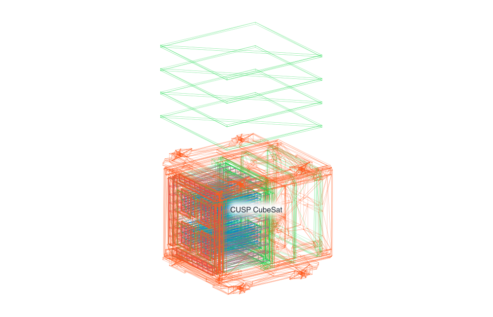](cusp-hero-oblique.pdf)

[PDF](cusp-hero-oblique.pdf) · [SVG](cusp-hero-oblique.svg)

## Opposite oblique

[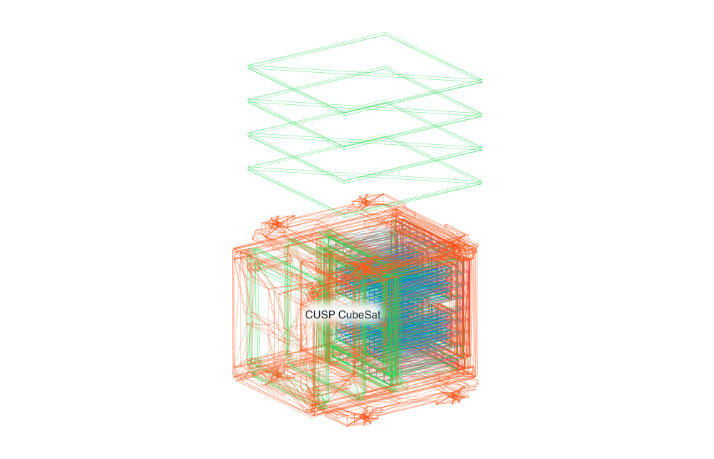](cusp-opposite-oblique.pdf)

[PDF](cusp-opposite-oblique.pdf) · [SVG](cusp-opposite-oblique.svg)

## High rear oblique

[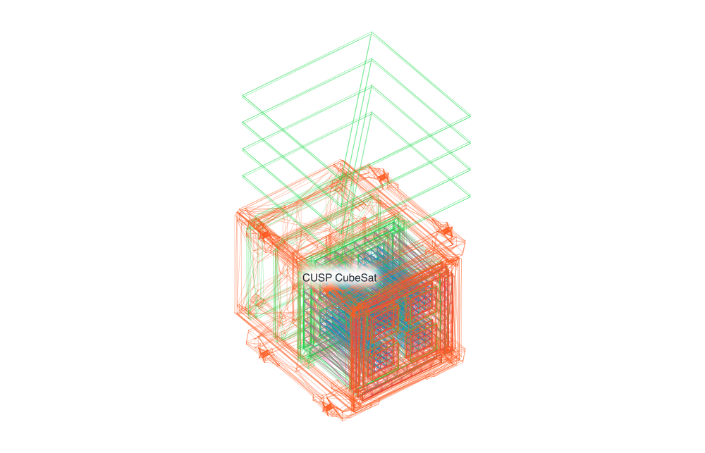](cusp-high-rear-oblique.pdf)

[PDF](cusp-high-rear-oblique.pdf) · [SVG](cusp-high-rear-oblique.svg)

## Underside oblique

[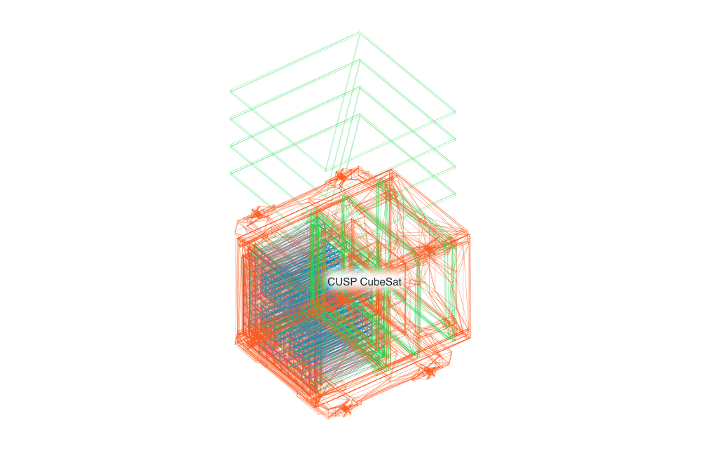](cusp-underside-oblique.pdf)

[PDF](cusp-underside-oblique.pdf) · [SVG](cusp-underside-oblique.svg)

## X profile

[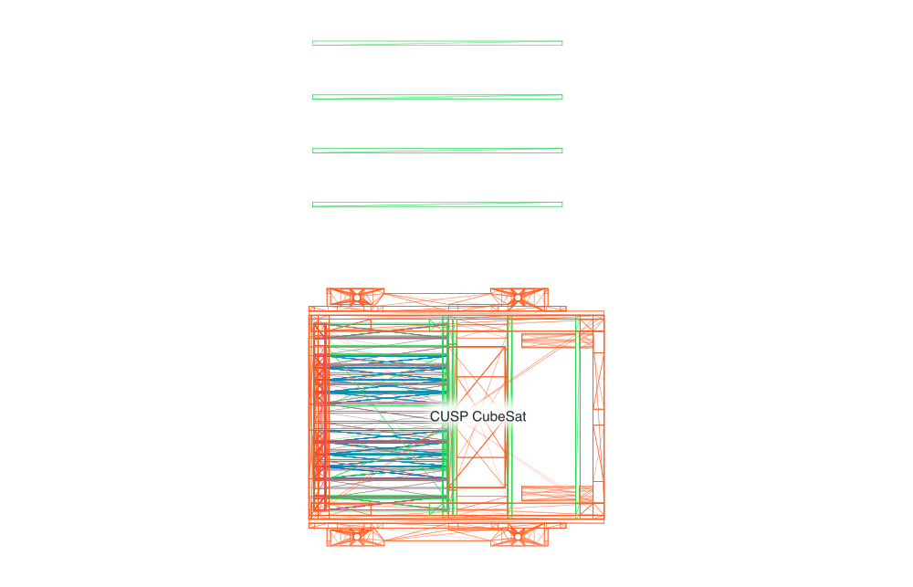](cusp-x-profile.pdf)

[PDF](cusp-x-profile.pdf) · [SVG](cusp-x-profile.svg)

## Y profile

[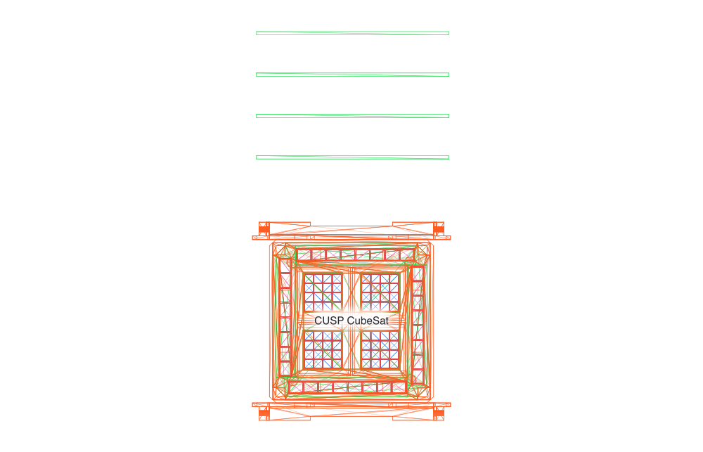](cusp-y-profile.pdf)

[PDF](cusp-y-profile.pdf) · [SVG](cusp-y-profile.svg)

## Z axial

[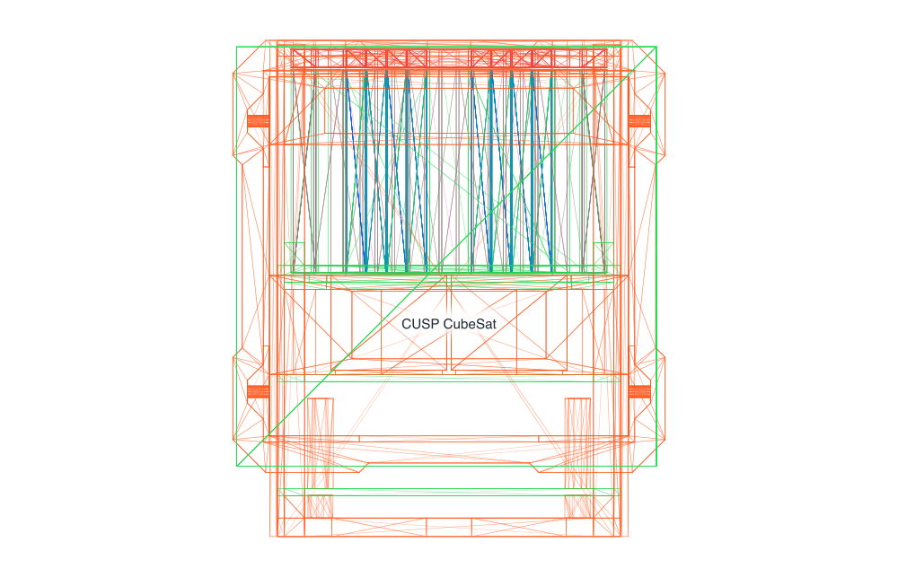](cusp-z-axial.pdf)

[PDF](cusp-z-axial.pdf) · [SVG](cusp-z-axial.svg)

## Detector cutaway

[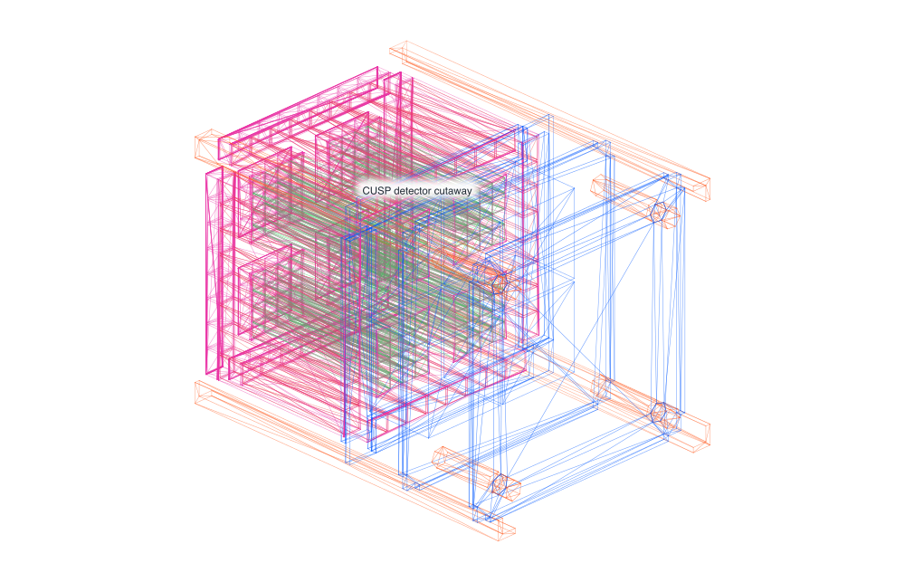](cusp-detector-cutaway.pdf)

[PDF](cusp-detector-cutaway.pdf) · [SVG](cusp-detector-cutaway.svg)

## Side section

[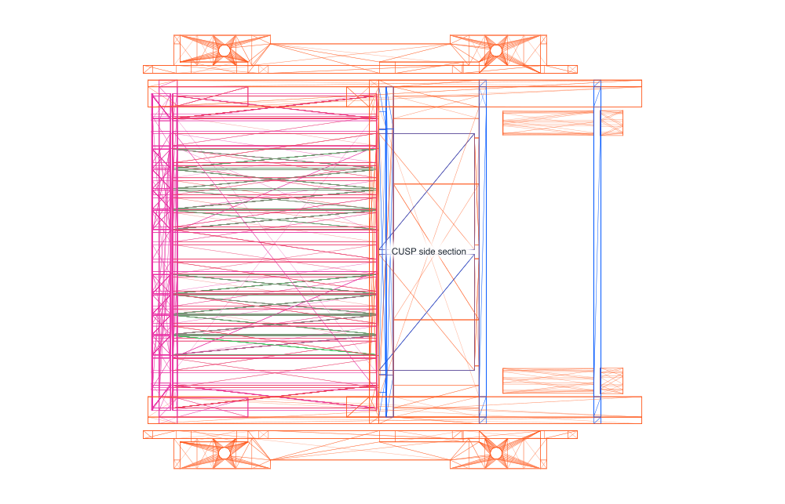](cusp-side-section.pdf)

[PDF](cusp-side-section.pdf) · [SVG](cusp-side-section.svg)

## Axial detector

[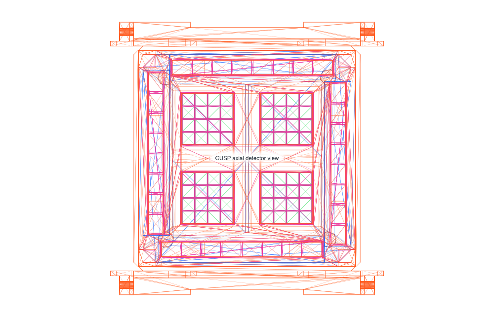](cusp-axial-detector.pdf)

[PDF](cusp-axial-detector.pdf) · [SVG](cusp-axial-detector.svg)

## Scatterer array

[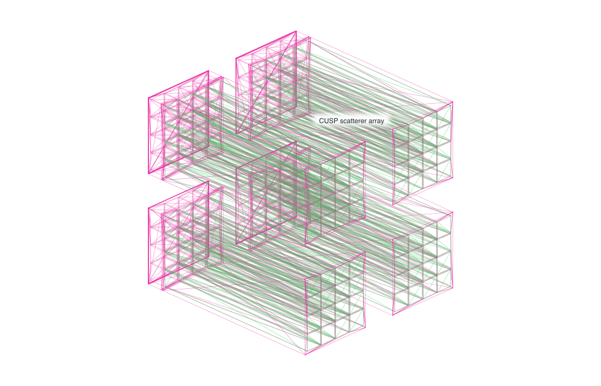](cusp-scatterer-array.pdf)

[PDF](cusp-scatterer-array.pdf) · [SVG](cusp-scatterer-array.svg)

## Absorber array

[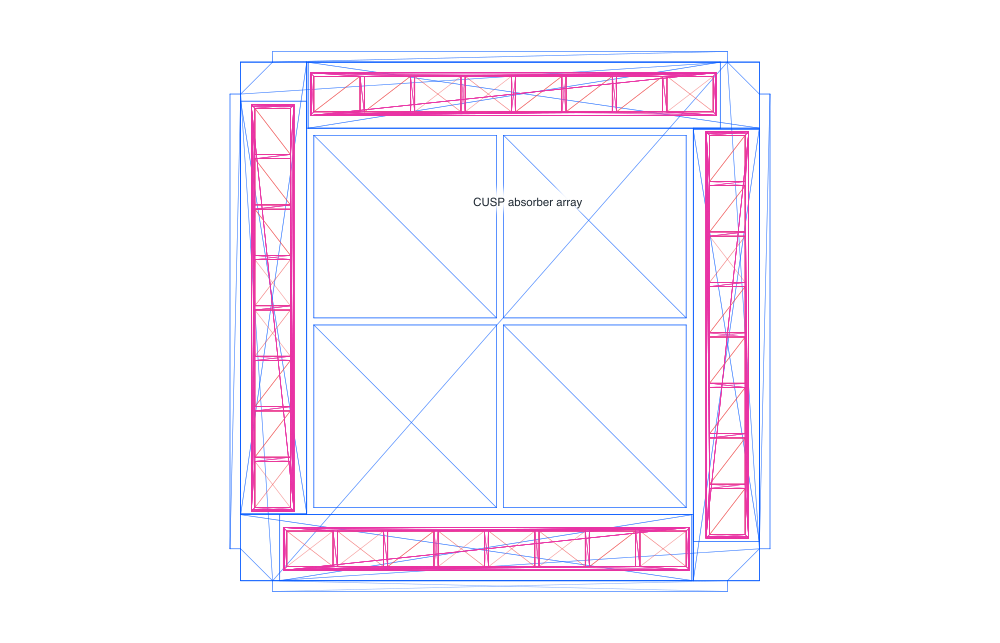](cusp-absorber-array.pdf)

[PDF](cusp-absorber-array.pdf) · [SVG](cusp-absorber-array.svg)
