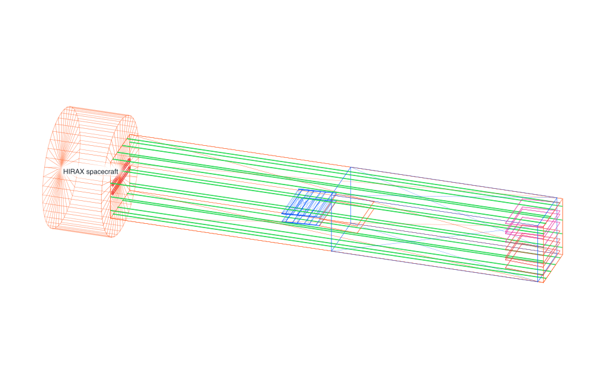
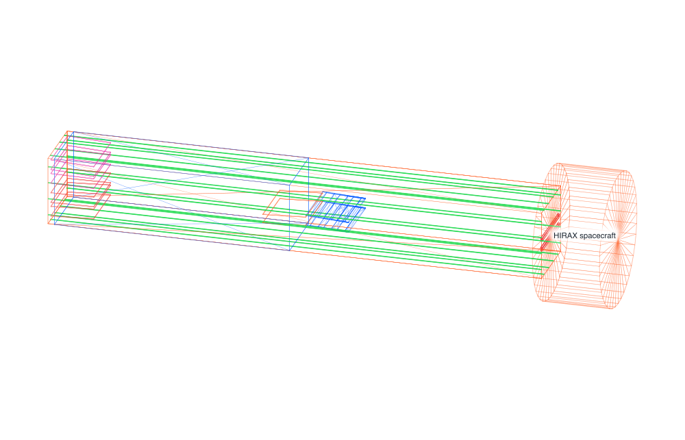
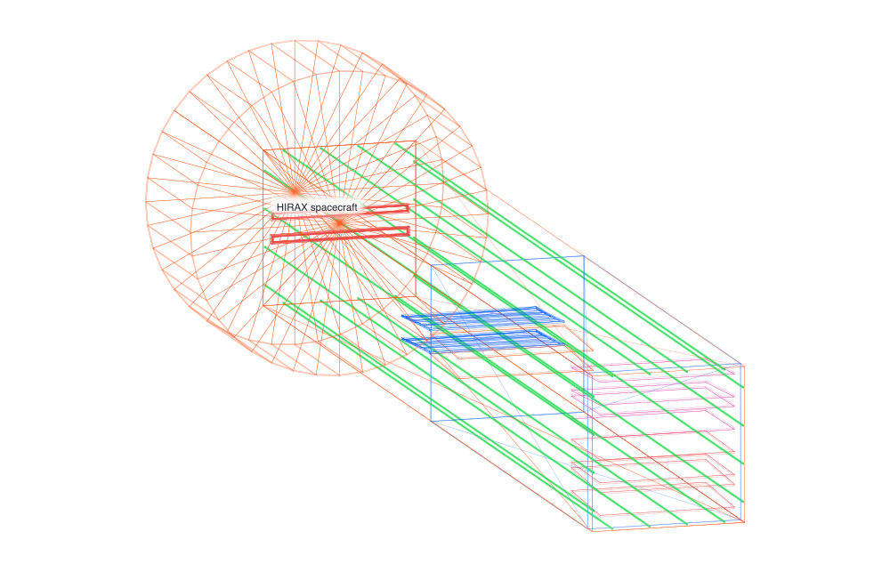
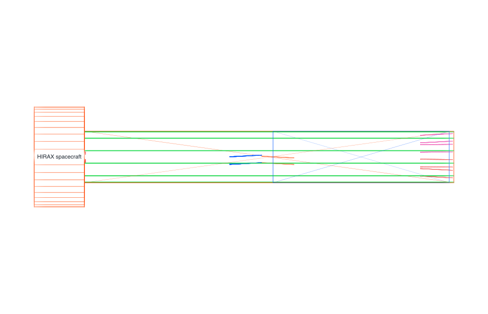
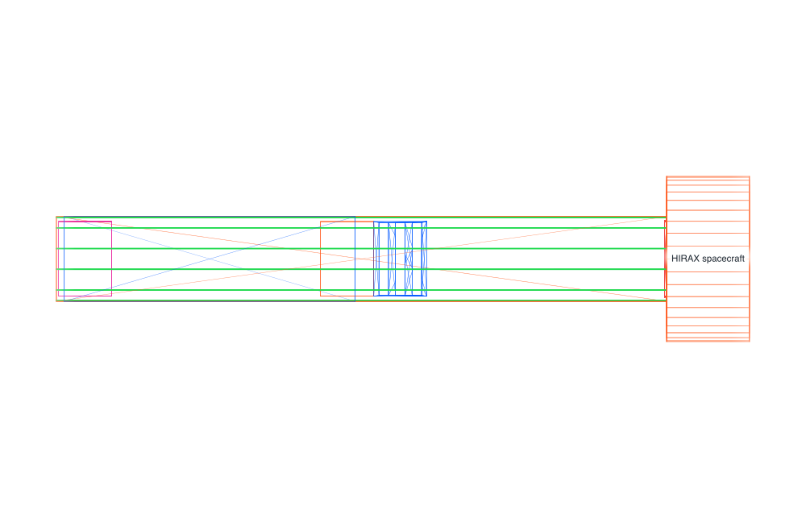
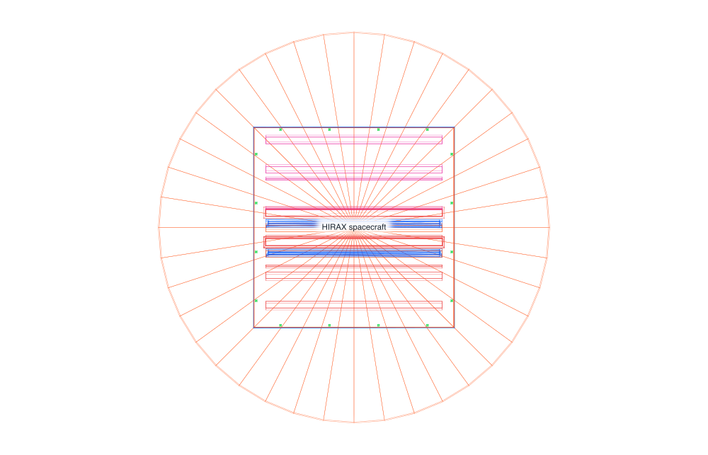
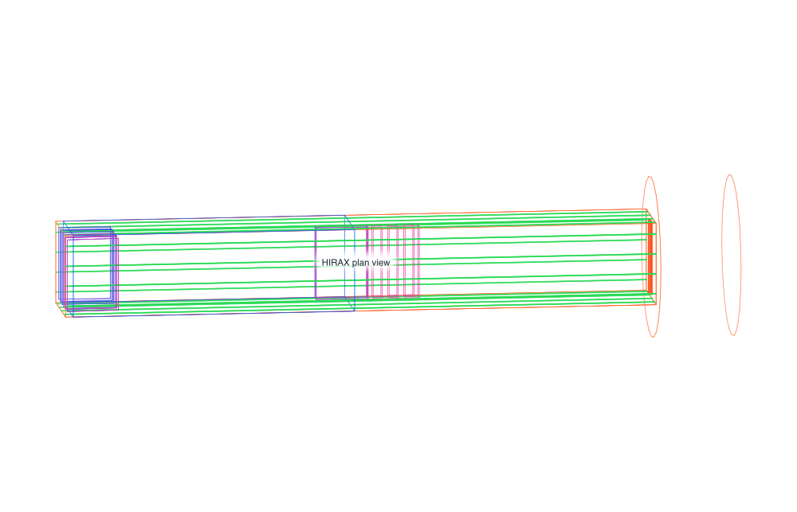
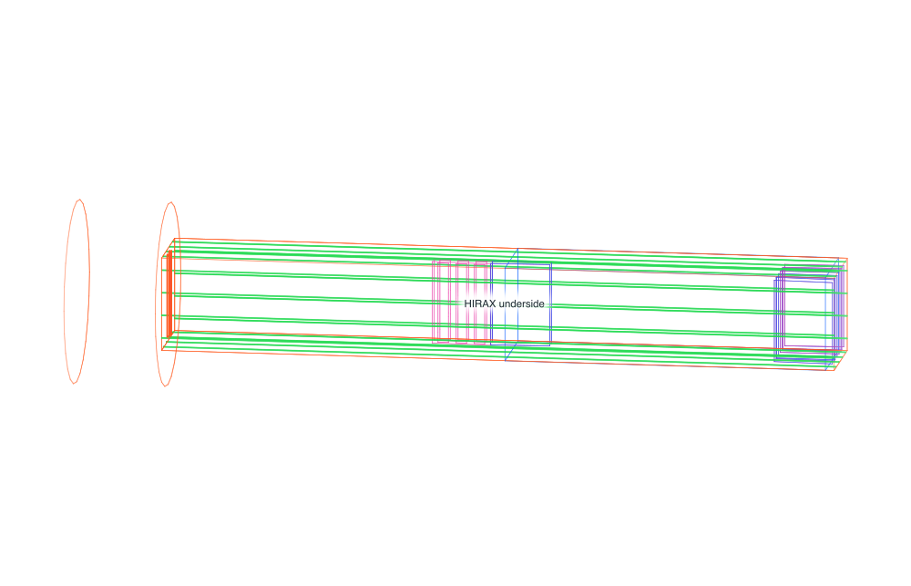
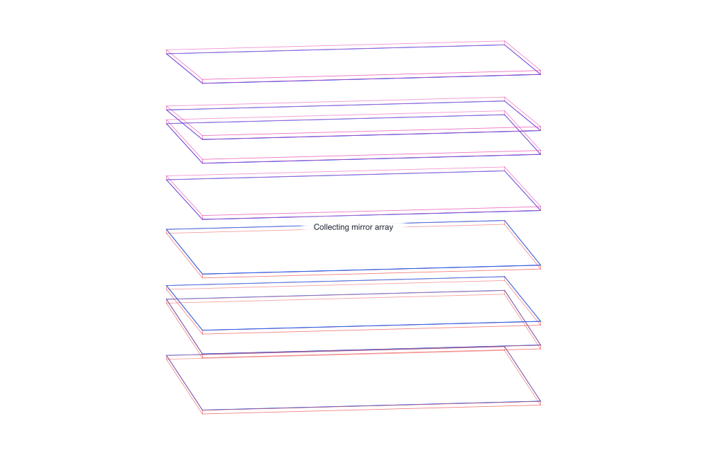
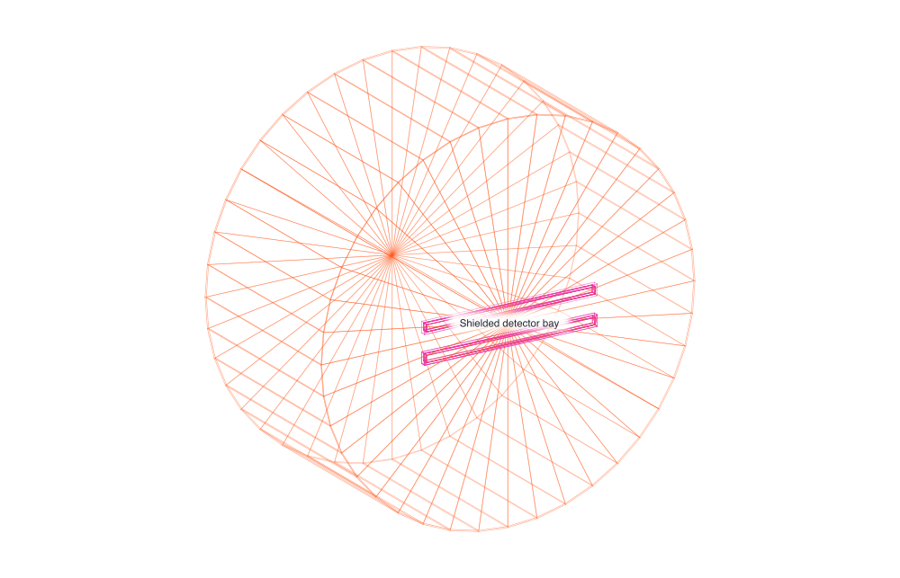

# HIRAX spacecraft

Ten views of the HIRAX X-ray-interferometer spacecraft GDML, rendered with a
shared high-contrast palette. Select any preview to open its PDF.

## Hero oblique

[PDF](hirax-hero-oblique.pdf) · [SVG](hirax-hero-oblique.svg)

## Opposite rear

[PDF](hirax-opposite-rear.pdf) · [SVG](hirax-opposite-rear.svg)

## Aft oblique

[PDF](hirax-aft-oblique.pdf) · [SVG](hirax-aft-oblique.svg)

## Port profile

[PDF](hirax-port-profile.pdf) · [SVG](hirax-port-profile.svg)

## Dorsal profile

[PDF](hirax-dorsal-profile.pdf) · [SVG](hirax-dorsal-profile.svg)

## Forward axial

[PDF](hirax-forward-axial.pdf) · [SVG](hirax-forward-axial.svg)

## Plan

[PDF](hirax-plan.pdf) · [SVG](hirax-plan.svg)

## Underside

[PDF](hirax-underside.pdf) · [SVG](hirax-underside.svg)

## Collecting-mirror detail

[PDF](hirax-mirror-detail.pdf) · [SVG](hirax-mirror-detail.svg)

## Detector bay

[PDF](hirax-detector-bay.pdf) · [SVG](hirax-detector-bay.svg)
