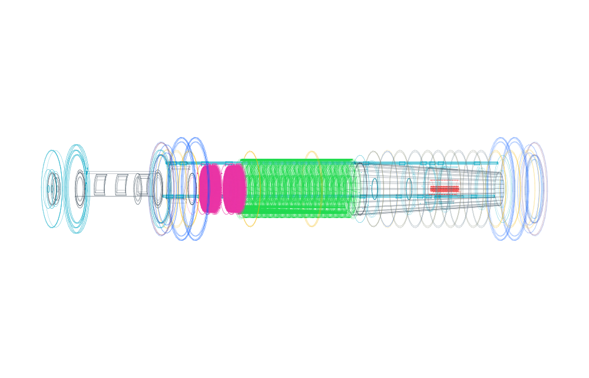
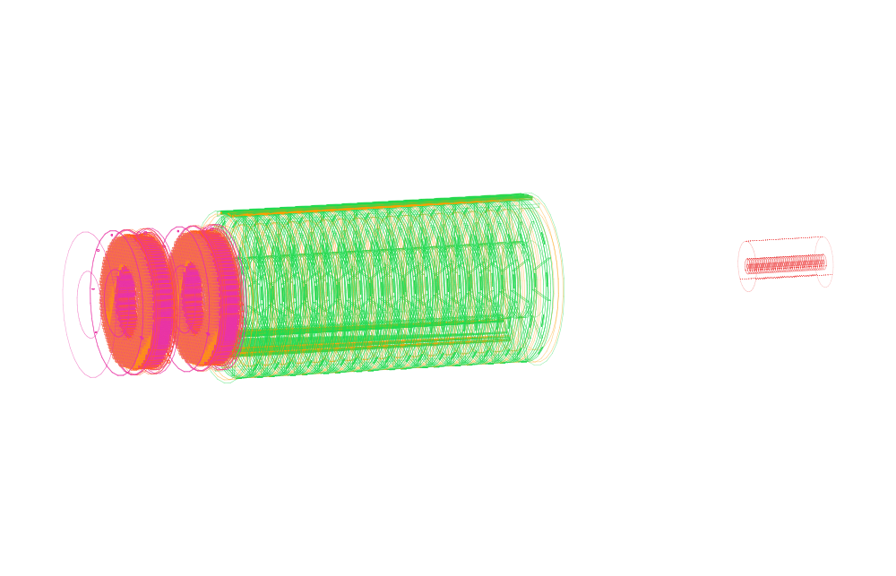
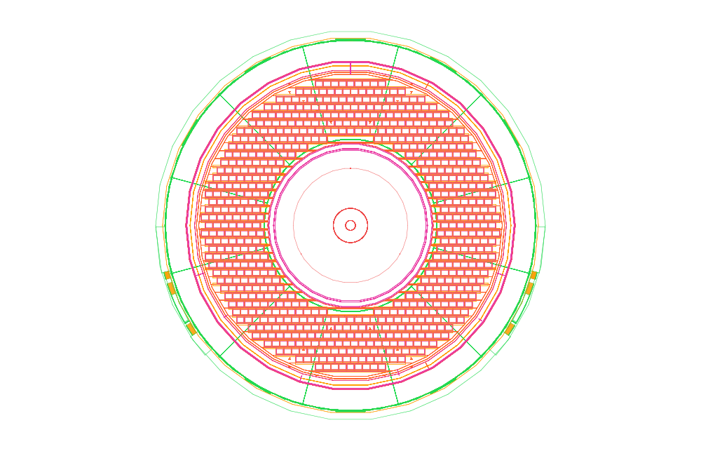

# Mu2e complete-experiment views

Five views of the full Mu2e v7.4.1 geometry from the official 2019 geometry
tutorial export. The model expands to 175,539 placed volumes and includes the
experimental hall, production and transport systems, detector solenoid,
tracker, calorimeter, stopping target, cosmic-ray veto, shielding, and civil
structures. Select any preview to open its PDF.

## Facility cutaway

[PDF](mu2e-facility-cutaway.pdf)

## Complete solenoid train

[PDF](mu2e-solenoid-train.pdf) · [SVG](mu2e-solenoid-train.svg)

## Detector-solenoid cutaway

[PDF](mu2e-detector-cutaway.pdf)

## Tracker, calorimeter, and stopping target

[PDF](mu2e-detector-core.pdf)

## Axial detector view

[PDF](mu2e-detector-axial.pdf)

All five PDFs remain vector artwork. Except for the compact solenoid-train
file, the raw SVGs are omitted because each is larger than 34 MB.
